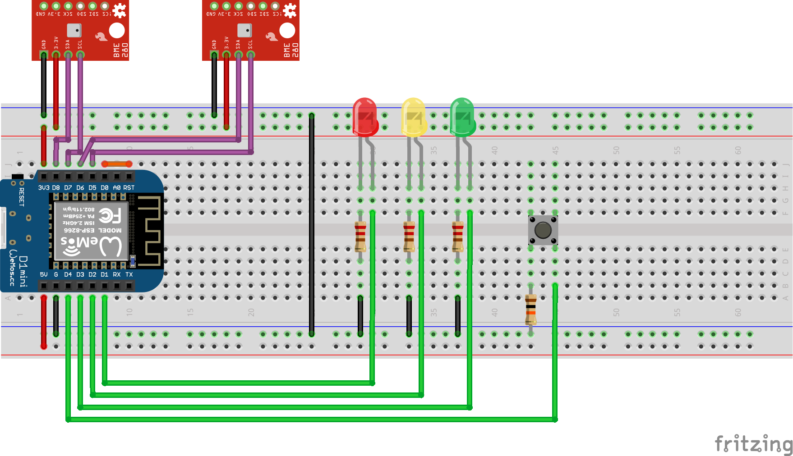

# yetAnotherWeatherStation

### BOM
[BME280 Sensor (humantity, temperature and air pressure)](https://de.aliexpress.com/item/1005006018085460.html?spm=a2g0o.productlist.0.0.3a64N4GoN4GofB&mp=1&gatewayAdapt=glo2deu)
[Wemos D1 Mini (ESP8266/Arduino (clone) with wireless connection)](https://de.aliexpress.com/item/1005006185888924.html?src=google&src=google&albch=shopping&acnt=272-267-0231&isdl=y&slnk=&plac=&mtctp=&albbt=Google_7_shopping&aff_platform=google&aff_short_key=UneMJZVf&gclsrc=aw.ds&&albagn=888888&&ds_e_adid=&ds_e_matchtype=&ds_e_device=c&ds_e_network=x&ds_e_product_group_id=&ds_e_product_id=de1005006185888924&ds_e_product_merchant_id=472809634&ds_e_product_country=DE&ds_e_product_language=de&ds_e_product_channel=online&ds_e_product_store_id=&ds_url_v=2&albcp=20542169885&albag=&isSmbAutoCall=false&needSmbHouyi=false&gad_source=1&gbraid=0AAAAAoukdWPxTYQ8lwdwflwCIHxhv9FyQ&gclid=CjwKCAjwxNW2BhAkEiwA24Cm9PLjbKXXciCFG14pKscFx_dcN9p5VWaC95nYvGXK6DOMwPNAkCWpNRoCdrYQAvD_BwE)

optional: 
[some LEDs](https://de.aliexpress.com/item/1005006462860778.html?spm=a2g0o.productlist.main.1.1c4d2227YOWaHA&algo_pvid=f4def90a-fca8-405a-8d8b-15b392cf12d8&algo_exp_id=f4def90a-fca8-405a-8d8b-15b392cf12d8-0&pdp_npi=4%40dis%21EUR%211.34%211.29%21%21%2110.27%219.89%21%402103856417253025167453361ef7f8%2112000037284612046%21sea%21DE%214171284562%21X&curPageLogUid=cgZ0pzYbKn6h&utparam-url=scene%3Asearch%7Cquery_from%3A)
RJ45 Ports and Connectors
Button(s)
Resistors (3x 220, 1x 10000 [Ohm])

### Wiring

*Green = Data wires (optioinal), violett = Data wires necessary, red = 3,3V wire, black = ground